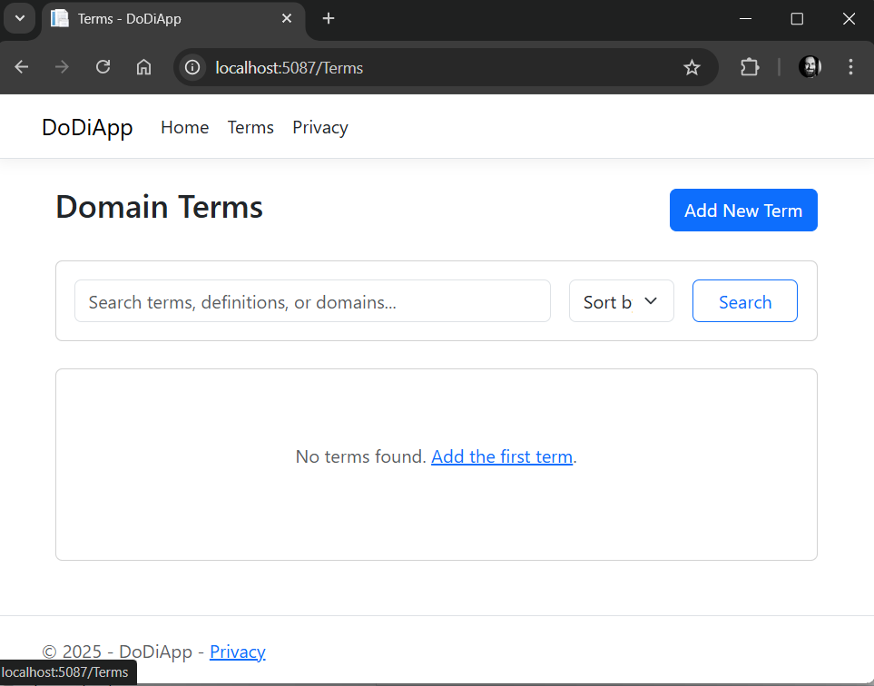
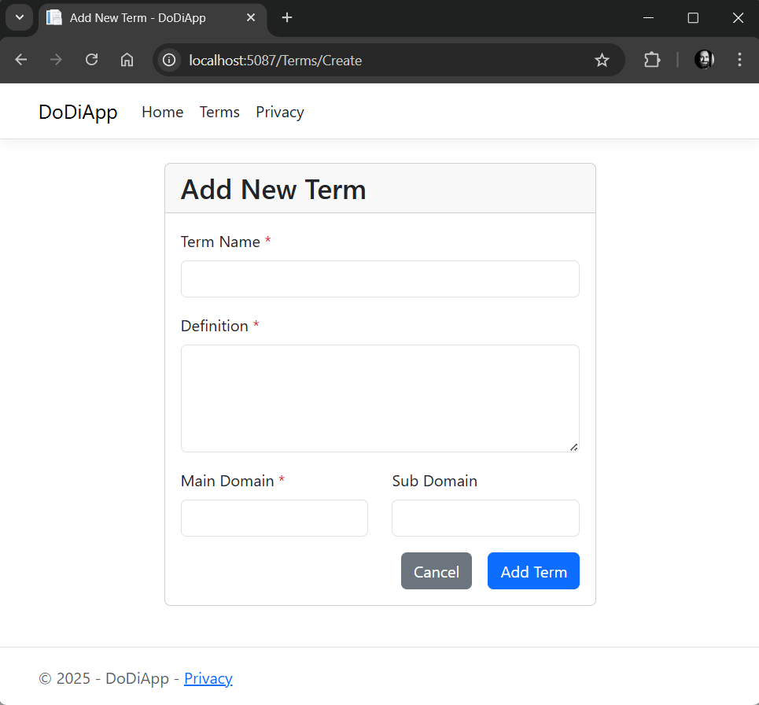
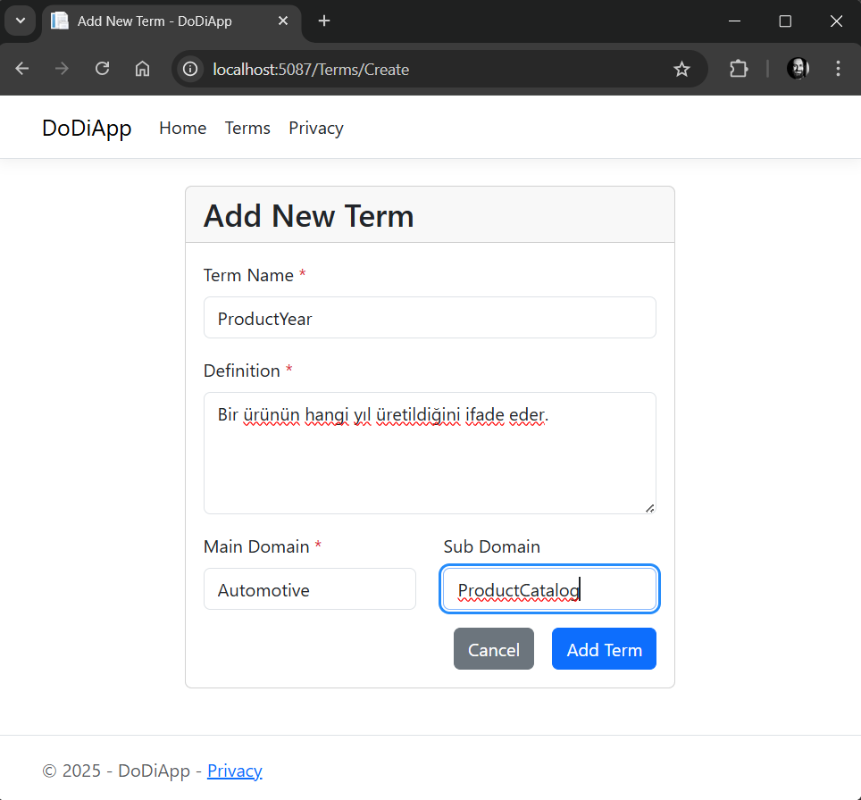
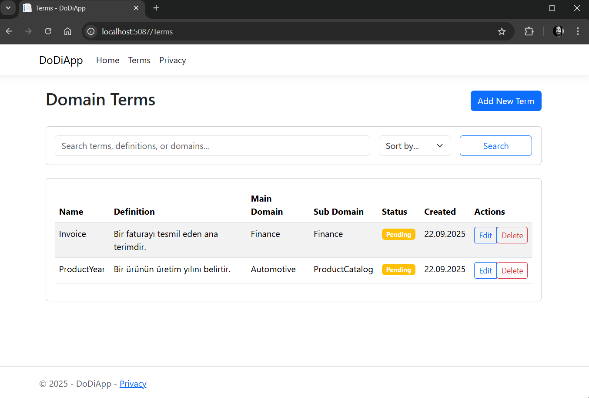

# DoDi Domain Dictionary Application

Bu proje DDD ile geliştirme yapanlar için bir domain sözlüğü uygulamasıdır. Kullanıcılar, domain terimlerini ekleyebilir, düzenleyebilir ve silebilirler. Ayrıca, terimleri arayabilir ve filtreleyebilirler. Proje Grok Code Fast 1 (Preview) ile geliştirilmiştir. Proje gereksinimleri ve Grok'tan bekleneneler .context klasörü altında yer alan `project-overview.md` dosyasında detaylı olarak açıklanmıştır.

```bash
# EF Migrations için
dotnet ef migrations add InitialCreate

# Veritabanını güncellemek için
dotnet ef database update
```

## Çalışma Zamanı

Geliştirmelerin bir kısmı Github Codespaces üzerinde yapıldı. Windows 11 tabanlı yerel bilgisayar üzerinde de geliştirmelere devam edildi ve testler gerçekleştirildi. Versiyonlara bağlı olarak çalışma zamanına ait örnek görüntüler aşağıdaki gibidir.

## Version 1.0

Version 1.0 sürümüne ait örnek ekran görüntüleri aşağıdaki gibidir:







