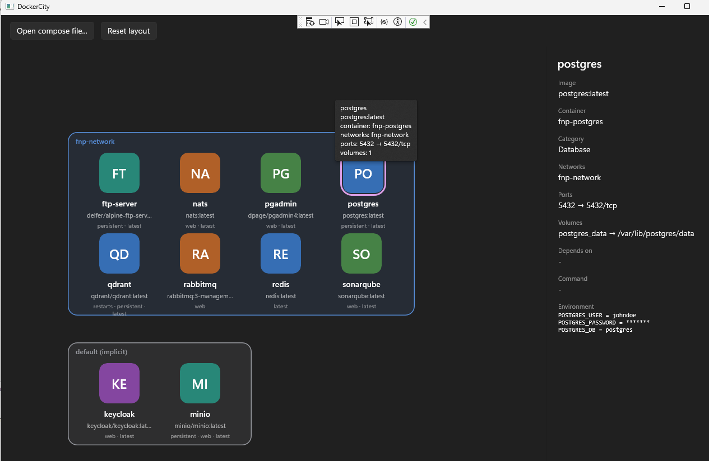

# DockerCity

Bir `docker-compose.yml` dosyasındaki servisleri ve aralarındaki ilişkileri **oyunlaştırılmış bir şehir haritası** olarak gösteren Windows masaüstü uygulaması.

Servisler şehrin sakinleri, network'ler mahalleler, `depends_on` ilişkileri aralarındaki yollar. Bir figürün üzerine gelindiğinde image adı, container adı, portlar ve volume bilgileri balon pencerede açılır.

Diğer çalışmalardan farkı: bu proje tek seferde bir modele yazdırılmadı. **Faz faz ilerleyen bir öğreti** olarak kurgulandı; her aşamada önce doküman yazıldı, sonra kod ona göre geliştirildi. Amaç çalışan aracı üretmek kadar WinUI 3, YamlDotNet, OOP modelleme ve EF Core konularında adım adım ilerleyen bir malzeme bırakmak.

## Teknoloji

.NET 10 · WinUI 3 (Windows App SDK) · YamlDotNet · EF Core + SQLite · CommunityToolkit.Mvvm · xUnit

## Durum

| Faz | Konu | Durum |
| --- | --- | --- |
| 0 | Solution iskeleti, çalışan WinUI 3 penceresi | Tamamlandı |
| 1 | YamlDotNet ile compose okuyucu, polimorfik alan converter'ları | Tamamlandı |
| 2 | Domain modeli, kalıtım hiyerarşisi, `CityMap` | Tamamlandı |
| 3 | EF Core + SQLite, image → ikon eşlemeleri | Tamamlandı |
| 4 | Canvas üzerinde ilk görselleştirme (MVVM) | Tamamlandı |
| 5 | Mahalle sınırları | Tamamlandı |
| 6 | Etkileşim, sürükle-bırak, konum kaydı (MVP) | Tamamlandı |
| 7 | Bağlantı okları (`depends_on`), Needed by | Tamamlandı |
| 8 | Kullanılabilirlik: menü, son açılanlar, tema, dışa aktarma | Tamamlandı |
| 9–10 | Zoom/pan ve animasyon, canlı Docker | Sıradaki |

Testler: 139 (Domain + Parsing + Data).

## Klasör yapısı

```
DockerCity/
├── DockerCity.slnx
├── Directory.Build.props
├── src/
│   ├── DockerCity.Domain/     entity'ler, değer nesneleri, CityMap, yerleşim   (net10.0)
│   ├── DockerCity.Parsing/    YamlDotNet DTO'ları + domain'e mapper            (net10.0)
│   ├── DockerCity.Data/       EF Core + SQLite, image kataloğu                 (net10.0)
│   └── DockerCity.App/        WinUI 3 arayüzü                     (net10.0-windows…)
└── tests/
    ├── DockerCity.Domain.Tests/
    ├── DockerCity.Parsing.Tests/
    └── DockerCity.Data.Tests/
```

Çekirdek üç katman platformdan bağımsız `net10.0` hedefler; yalnızca `DockerCity.App` Windows'a bağlıdır. Böylece UI tiplerinin iş mantığına sızması derleme zamanında engellenir.

## Çalıştırma

```powershell
dotnet build
dotnet test
dotnet build src\DockerCity.App\DockerCity.App.csproj -p:Platform=x64
```

Visual Studio'da `DockerCity.App` başlangıç projesi yapılıp **DockerCity.App (Unpackaged)** profiliyle çalıştırılır. Uygulama açıldığında **Open compose file…** ile bir compose dosyası seçilir.

Veritabanı ilk çalıştırmada `%LOCALAPPDATA%\DockerCity\dockercity.db` altında oluşturulur.

## Dokümanlar

- [`docs/PLAN.md`](./docs/PLAN.md) — mimari, veri modeli ve 11 fazlık yol haritası
- [`docs/tutorial/`](./docs/tutorial/) — faz faz ilerleyen öğreti dokümanları

| Faz | Doküman |
| --- | --- |
| 0 | [Kurulum ve solution iskeleti](./docs/tutorial/00-kurulum-ve-iskelet.md) |
| 1 | [YamlDotNet ile compose okuyucu](./docs/tutorial/01-yaml-parser.md) |
| 2 | [Domain modeli ve OOP hiyerarşisi](./docs/tutorial/02-domain-modeli.md) |
| 3 | [SQLite kalıcılık katmanı](./docs/tutorial/03-sqlite-ef-core.md) |
| 4 | [Canvas ve MVVM](./docs/tutorial/04-canvas-ve-mvvm.md) |
| 5 | [Mahalle sınırları](./docs/tutorial/05-mahalle-bolgeleri.md) |
| 6 | [Etkileşim — MVP](./docs/tutorial/06-etkilesim.md) |
| 7 | [Yollar ve ilişkiler](./docs/tutorial/07-baglantilar.md) |
| 8 | [Kullanılabilirlik](./docs/tutorial/08-kullanilabilirlik.md) |

Her doküman aynı kalıpta: ne yapacağız, **neden böyle**, adım adım uygulama, takıldığın yerler, ne öğrendik, kendin dene.

## Çalışma Zamanı

İlk MVP çıktıktan sonra çalışma zamanından bir görüntü.


