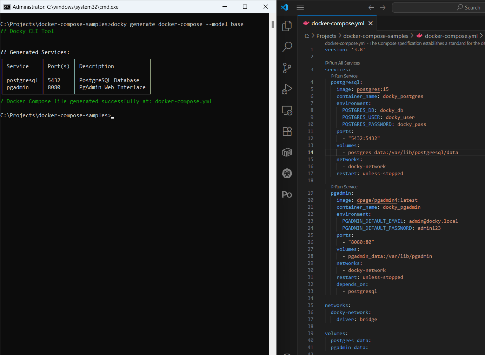
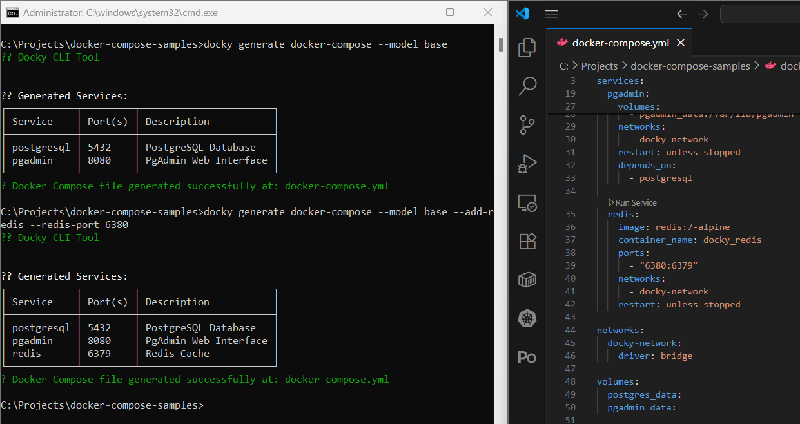
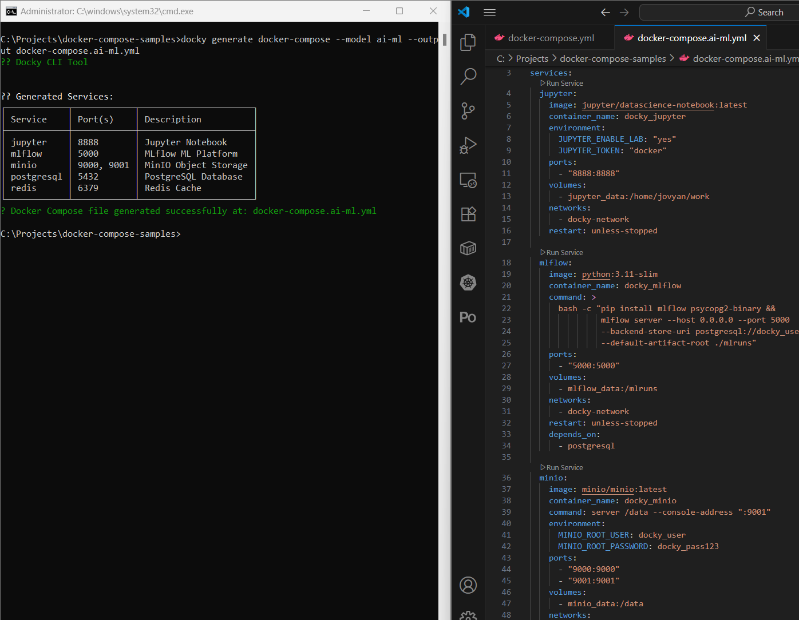

# Docky CLI Tool

Bu çalışmada Sonnet'den bir .net tool aracı yazması istendi. Araç belirli geliştirme modelleri için docker-compose dosyalarının kolayca oluşturulmasını sağlıyor. Proje Sonnet 4.0 kullanılarak C# dilinde .Net 9.0 platformunda geliştirildi.

## Sorular

Projenin geliştirilemsi sırasında Sonnet'e aşağıdaki sorular yöneltildi:

- **Soru 1(Agent Mode Açık):** Merhaba.
Docky\.context klasöründe yer alan DockyCLITool.md dokümanını inceleyip, bashedilen uygulamayı src klasörü altında DockyApp ismiyle oluşturman mümkün mü?

---

- **Soru 2(Ask Mode Açık):** Projede base ve full isimli iki model yer alıyor. Sence farklı olarak ne tür modeller önerebiliriz.

---

- **Soru 3(Agent Mode Açık):** Burada bahsettiğin tüm modelleri entegre edebilir misin?

---

- **Soru 4(Agent Mode Açık):** Oluşan docker-compose örneklerinde fazladan boş satırlar olduğunu görüyorum. Aşağıdaki gibi.

```yml
  postgresql:
    image: postgres:15

    container_name: docky_postgres

    environment:

      POSTGRES_DB: docky_db

      POSTGRES_USER: docky_user

      POSTGRES_PASSWORD: docky_pass

    ports:

      - "5432:5432"

    volumes:

      - postgres_data:/var/lib/postgresql/data
```

Bu sorunu giderebilir misin?

## Çalışma Zamanı

Windows 11 sisteminde örnek kullanımlar ve çıktıları aşağıdaki gibidir.

**Base Model**

```bash
docky generate docker-compose --model base
```



**Redis'i özel Port ile Base Modele Ekleme**

> Bu kullanımda özet görünümde problem var. Port değeri dosyada 6380 olarak ayarlansa da raporda 6379 olarak görünüyor. Ancak docker-compose dosyasında doğru port ayarlanıyor.

```bash
docky generate docker-compose --model base --add-redis --redis-port 6380
```



**Docker Compose Dosya Adını Özelleştirme**

```bash
docky generate docker-compose --model ai-ml --output docker-compose.ai-ml.yml
```



## Notlar

- Docker-Compose dosyaları eski stilde oluşturuluyor gibi. Yeni formatlarda dosya başında versiyon bilgisi yer almıyor. Belki güncel docker-compose kuralları da dokümana eklenebilir.
- Servislerin docker imajlarından bazıları eski sürümleri kullanıyor. Güncel sürümler için bir hub servisinden yararlanılabilir belki de? Yani aracımız aslında bir servis hub'a bağlanıp güncel ve doğrulanmış servis şablonlarını oradan çekebilir.