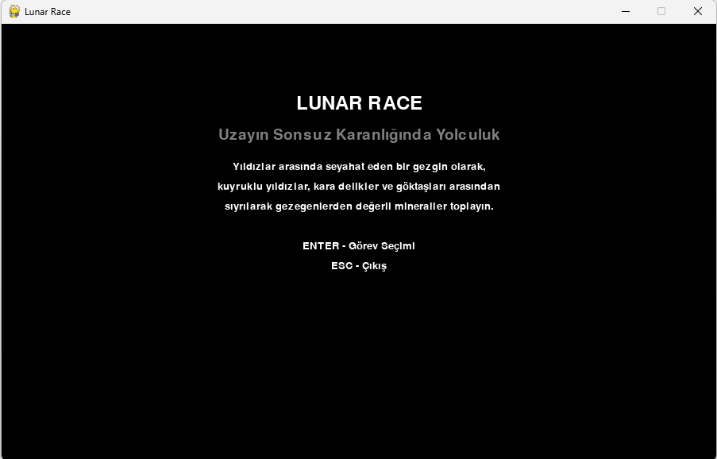
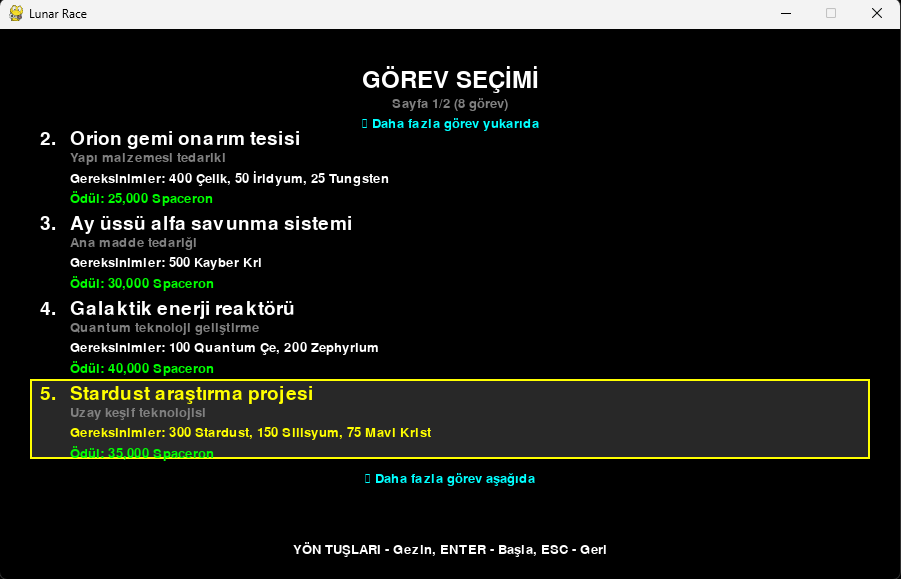
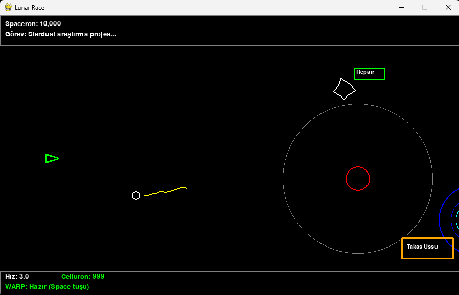
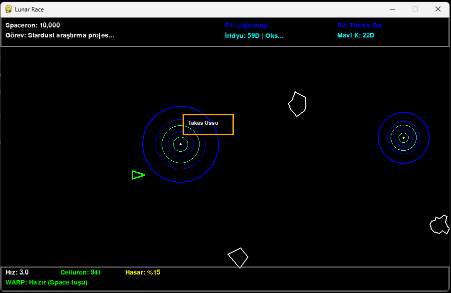
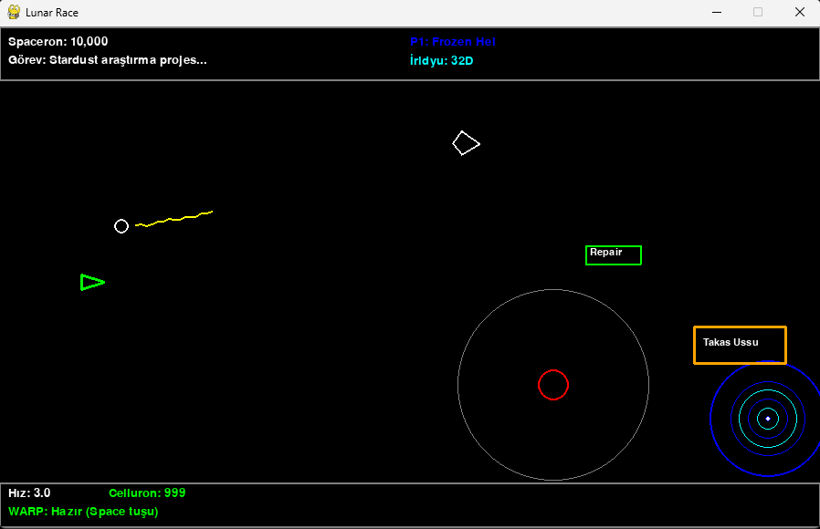
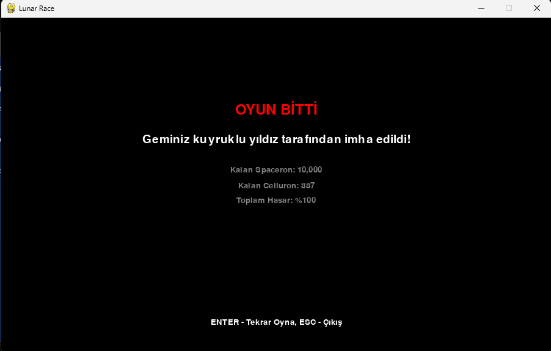

# Lunar Race - 2D Platform Uzay Oyunu

## Çalışma Hakkında

Bu çalışmada `VS Code Copilot` üzerinden `Claude Sonnet 4` ajanını kullanarak, verilen bir oyun tasarım dokümanı üzerinden hareketle basit bir `2D platform` oyununu geliştirme tecrübesi deneyimlenmeye çalışılmıştır. Çalışma adımları kısaca aşağıdaki gibidir.

- .context klasöründe bir GDG _(Game Design Document)_ dosyası hazırlandı.
- chat_history dosyasında belirtilen sorularla ilerlenerek kodun tamamlanması sağlandı.

## Özet

Lunar Race, Python ve Pygame kullanılarak geliştirilmiş 2D platform tabanlı uzay oyunudur. Oyuncu bir uzay mekiği kullanarak yıldızlar arasında yolculuk eder, çeşitli tehlikelerden kaçar ve değerli mineraller toplayarak görevleri tamamlar.

## 🎮 Oyun Hakkında

Uzayın sonsuz karanlığında yıldızlar arasında seyahat eden bir gezgin olarak, kuyruklu yıldızlar, kara delikler ve göktaşları arasından sıyrılarak bir gezegenden ötekine yolculuk edeceksiniz. Amacınız gittiğiniz gezegenlerden değerli mineraller toplamak ve listede yer alan görevleri tamamlayarak galaksi vatandaşlarına yardımcı olmaktır.

## 🚀 Özellikler

- **Vektör Grafik Tabanlı**: Tüm aktörler vektör çizgilerden oluşur
- **Dinamik Oyun Dünyası**: Rastgele oluşturulan aktörler ve gezegenler
- **Çeşitli Aktörler**: Göktaşları, kara delikler, kuyruklu yıldızlar, onarım gemileri
- **Mineral Sistemi**: 10 farklı mineral türü ve takas sistemi
- **Görev Sistemi**: Çeşitli görevler ve ödüller
- **WARP Sistemi**: Hızlı seyahat imkanı
- **Hasar ve Onarım**: Gerçekçi hasar sistemi

## 🎯 Oyun Mekanikleri

### Temel Oynanış

- Başlangıçta 10,000 Spaceron bütçesi ve 1,000 Celluron enerjisi
- Görev seçimi ve gezegen keşfi
- Mineral toplama ve ticaret
- Tehlikelerden kaçınma

### Aktörler

- **Mekik**: Oyuncunun kontrolündeki üçgen uzay aracı
- **Göktaşları**: Farklı şekillerde dönen tehlikeli nesneler
- **Kara Delik**: Gemiyi çeken ve hasar veren tehlikeli bölgeler
- **Onarım Gemisi**: Gemiyi tamir eden ve yakıt sağlayan yardımcı
- **Kuyruklu Yıldız**: En tehlikeli aktör (%100 hasar)
- **Gezegenler**: Mineral kaynakları (arka plan)
- **Takas Üssü**: Mineral alım-satımı için

### Birimler

- **Doka**: Mineral miktarı birimi (1 Doka = 1000 birim)
- **Spaceron**: Para birimi
- **Celluron**: Enerji birimi

## 🎮 Kontroller

| Tuş | İşlev |
|-----|-------|
| `W/A/S/D` veya `Yön Tuşları` | Mekik hareketi |
| `Space` | WARP hızı (5 saniye, 60 saniye cooldown) |
| `Enter` | Menülerde seçim |
| `ESC` | Geri/Çıkış |

## 📋 Kurulum

### Gereksinimler

- Python 3.7 veya üzeri
- Pygame kütüphanesi

### Adımlar

1. **Repository'yi klonlayın:**

   ```bash
   git clone <repository-url>
   cd LunarRace
   ```

2. **Bağımlılıkları yükleyin:**

   ```bash
   pip install -r requirements.txt
   ```

   veya manuel olarak:

   ```bash
   pip install pygame
   ```

3. **Oyunu başlatın:**

   ```bash
   cd src
   python main.py
   ```

## 🗂️ Proje Yapısı

```text
LunarRace/
├── src/
│   ├── main.py          # Ana program
│   ├── game.py          # Ana oyun sınıfı
│   ├── actors.py        # Aktör sınıfları
│   ├── constants.py     # Sabitler ve yapılandırma
│   └── utils.py         # Yardımcı fonksiyonlar
├── requirements.txt     # Python bağımlılıkları
├── README.md           # Bu dosya
└── .context/
    └── gdg.md          # Game Design Document
```

## 🎯 Görev Örnekleri

1. **Merkez koloni su arıtma sistemi**: 350 Doka Oksijen
2. **Orion gemi onarım tesisi**: 400 Doka Çelik, 50 Doka İridyum, 25 Doka Tungsten
3. **Ay üssü alfa savunma sistemi**: 500 Doka Kayber Kristal

## 🌌 Mineral Türleri

- Çelik
- Oksijen
- Tungsten
- Gümüş
- Mavi Kristal
- Kayber Kristal
- İridyum
- Demir
- Silisyum
- U-235

## 🪐 Örnek Gezegen Adları

- Grenwood
- Alpha 356
- Odsseyy Hole
- Shock Hole
- Black Widow
- Redroom
- Blinky Shadow
- Tatuyin
- S-Bull
- Hardal
- Edge of the Universe

## ⚙️ Teknik Detaylar

- **Ekran Boyutu**: 900x500 piksel
- **Frame Rate**: 60 FPS
- **Grafik Motoru**: Pygame (vektör çizgiler)
- **Programlama Dili**: Python 3.7+

## 🔧 Geliştirme Notları

- Tüm aktörler vektör grafiklerle çizilir
- Collision detection dikdörtgen tabanlıdır
- Rastgele içerik oluşturma sistemi mevcuttur
- Modüler kod yapısı gelecekteki geliştirmeler için uygundur

## 🎨 Grafik Stili

Oyun retro-futuristik vektör grafik stilinde tasarlanmıştır. Tüm aktörler ve UI elementleri çizgiler ve geometrik şekillerle oluşturulmuştur. Bu stil hem nostaljik bir his verir hem de performans açısından optimize edilmiştir.

## 🚧 Gelecek Geliştirmeler

- [ ] Ses efektleri ve müzik
- [ ] Daha fazla aktör türü
- [ ] Çoklu gezegen sistemi
- [ ] Kaydetme/yükleme sistemi
- [ ] Başarı sistemi
- [ ] Çoklu seviye desteği

## 📝 Lisans

Bu proje eğitim amaçlı geliştirilmiştir.

---

## Çalışma Zamanından Örnek Görüntüler

### Day01













**İyi yolculuklar, uzay gezgini!** 🚀✨

> Doküman Claude Sonnet 4 ile oluşturulmuştur.
