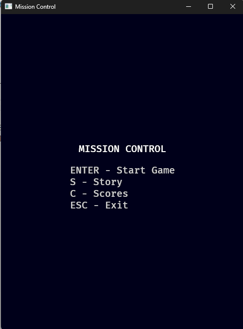
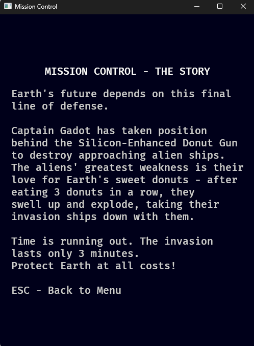

# Mission Control (Rust + Bevy 0.16)

Tam oyun akışını içeren basit, vektör-şekillerle temsil edilen Space-Invaders türevi.

## GDD’ye göre özellikler

- 3 dakika oyun süresi, HUD (Score/Lovers/Time/Bomb/Rapid)
- Ters yön kontrolleri (Left→sağ, Right→sol)
- Tank ateşi: 1/s, Spatula ile 0.25s
- Invader: 3 hız seviyesi, 3 isabet = yok
- Power-up Spatula (≥15sn aralıklı), Bomb (Space, 1 kez, 10sn zaman donması)
- Kayıp: 10 gemi ya da toplam 100 Donut Lover
- Skor: Başlangıç 100, gemi düşür +10, yere inen gemi kadar puan azalt
- Scores ekranı için game.dat JSON dosyası: { "best": number, "history": [number, ...max5] }

## Kurulum

- Rust stable ve cargo kurulu olmalı.
- Bevy 0.16 Windows 11’de çalışır.

## Çalıştırma

- assets/fonts altına bir font dosyası koyun ya da `src/main.rs` içindeki font yolunu değiştirin.
- Derleyip çalıştırın:

```powershell
cargo run --release
```

## Notlar

- Grafikler Sprite ile basit dikdörtgen/daire boyutlarıyla temsil edildi.
- `game.dat` çalışma dizinine yazılır/okunur.
- Story ve Scores ekranları için iskelet basit tutuldu; içerik genişletilebilir.

## Çalışma Zamanından Görüntüler

Giriş ekranı





