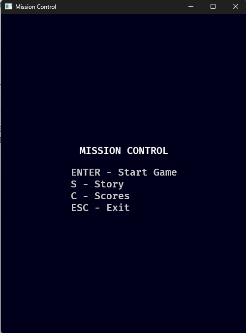
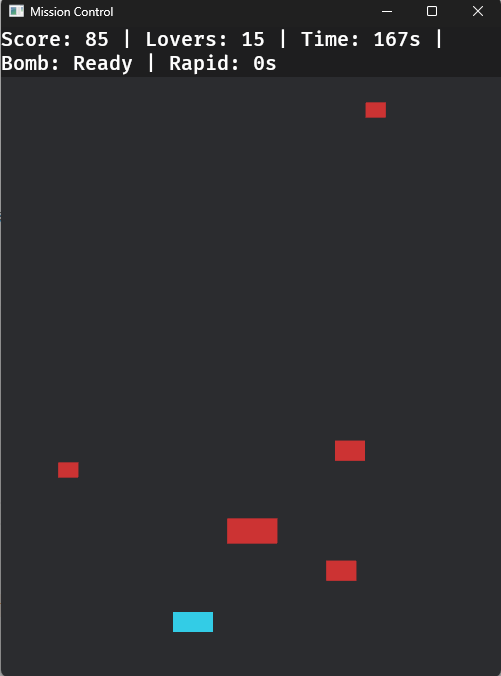
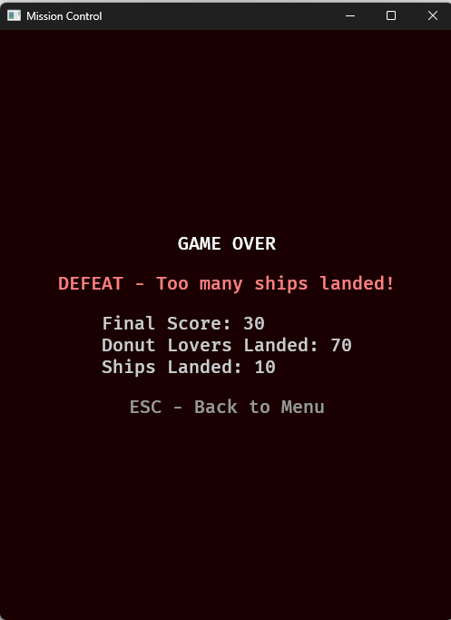
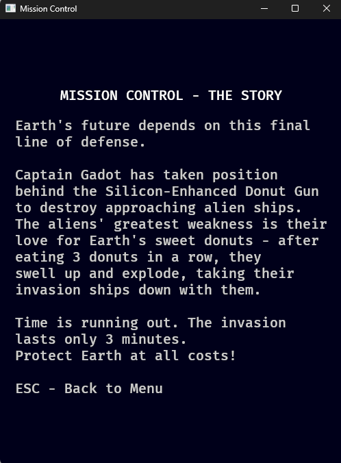

# Mission Control (Rust + Bevy 0.16)

GDG dokümanına göre geliştirilmiş klasik Space Invaders türevi oyun. Temiz ECS mimarisi ile modüler yapıda kodlanmıştır.

## 🎮 Oyun Özellikleri (GDG'ye Uygun)

### Ana Mekanikler

- **3 dakika** oyun süresi sınırı
- **Ters kontrol sistemi**: Left→sağ, Right→sol (GDG'de belirtildiği gibi)
- **Tank ateşi**: Normal 1/saniye, Rapid Fire ile 0.25 saniye
- **Invader sistemi**: 3 farklı boyut ve hız, 3 isabet ile yok olur
- **Power-up Spatula**: 15+ saniye aralıklarla, 10 saniye rapid fire
- **Electromagnetic Bomb**: Space tuşu, oyun başına 1 kez, 10 saniye zaman durdurma

### Kazanma/Kaybetme Koşulları

- **Kaybetme**: 10 gemi iner VEYA toplam 100 Donut Lover yere ulaşır
- **Skor sistemi**: Başlangıç 100 puan, gemi düşürme +10 puan, inen gemiler puan düşürür

### UI ve Ekranlar

- **HUD**: Score/Lovers/Time/Bomb/Rapid bilgileri
- **Ana Menü**: Start, Story, Scores, Exit seçenekleri
- **Skor Sistemi**: `game.dat` JSON dosyasında en iyi skor + son 5 oyun

## 🏗️ Proje Yapısı

```
MissionControl/
├── src/
│   ├── main.rs              # Ana uygulama giriş noktası
│   ├── lib.rs               # Library modül export'ları
│   ├── components.rs        # ECS Component tanımları
│   ├── resources.rs         # ECS Resource tanımları
│   ├── states.rs            # Oyun state enum'ları
│   ├── constants.rs         # Oyun sabitleri
│   └── systems/
│       ├── mod.rs           # Systems modül organizasyonu
│       ├── setup.rs         # Başlangıç setup sistemleri
│       ├── game.rs          # Ana oyun mekaniği sistemleri
│       ├── ui.rs            # UI ve menü sistemleri
│       ├── input.rs         # Input handling sistemleri
│       └── persistence.rs   # Skor kaydetme/yükleme
├── Cargo.toml               # Rust dependencies
└── README.md                # Bu dosya
```

### 🔧 Modüler ECS Mimarisi

#### Components (`components.rs`)
- **Tank, Donut, Invader, Spatula**: Oyun entity'leri
- **UI Marker Components**: MenuRoot, GameOverRoot, HudText vb.

#### Resources (`resources.rs`)
- **ScoreBoard**: Mevcut skor, en iyi skor, geçmiş
- **Counters**: İnen Donut Lover ve gemi sayıları
- **Timers**: Spawn, powerup, oyun, rapid fire zamanlayıcıları
- **Flags**: Rapid fire aktif mi, bomb kullanıldı mı gibi durumlar

#### Systems (`systems/`)
- **Game Systems**: Tank movement, firing, collision, spawning
- **UI Systems**: Menu setup/cleanup, HUD updates, screen transitions
- **Input Systems**: Menü navigasyonu, gameplay kontrolleri
- **Setup Systems**: Kamera, HUD, oyun başlangıç ayarları
- **Persistence**: Skor dosyası okuma/yazma

#### States (`states.rs`)
- **GameState enum**: MainMenu → Story → Game → GameOver → Scores döngüsü

## 🚀 Kurulum ve Çalıştırma

### Gereksinimler
- **Rust**: Stable sürüm (2021 edition)
- **OS**: Windows 11 (test edildi)
- **GPU**: Vulkan/DirectX 12 uyumlu (entegre GPU yeterli)

### Çalıştırma
```powershell
# Development modunda
cargo run

# Release modunda (optimized)
cargo run --release
```

## 🎯 Kontroller

| Tuş | Aksiyon |
|-----|---------|
| **A/Left Arrow** | Sağa hareket (ters kontrol) |
| **D/Right Arrow** | Sola hareket (ters kontrol) |
| **W/Up Arrow** | Ateş etme |
| **Space** | Electromagnetic Bomb (1 kez kullanım) |
| **Enter** | Menü seçimi/Oyun başlatma |
| **S** | Story ekranı |
| **C** | Scores ekranı |
| **ESC** | Geri/Çıkış |

## 📊 Teknik Detaylar

### Bevy 0.16 API Uyumluluğu
- **Modern ECS**: Entity-Component-System mimarisi
- **State Management**: Bevy States ile ekran geçişleri
- **Component-Based Rendering**: Sprite + Transform ayrı bileşenler
- **Timer Systems**: Bevy Timer API'ı ile zamanlama

### Performans
- **Efficient ECS**: Bevy'nin optimized query sistemleri
- **Minimal Memory**: Sadece gerekli entity'ler spawn edilir
- **Clean Architecture**: Modüler yapı ile kolay bakım

## 🎨 Görsel Tasarım

- **Vektör grafik** tabanlı (GDG'ye uygun)
- **500x650 piksel** çözünürlük
- **Retro Space Invaders** stili
- **Renk kodlaması**: 
  - Tank: Açık mavi
  - Donut: Turuncu  
  - Invader: Kırmızı
  - Spatula: Yeşil

## 🎮 Çalışma Zamanından Görüntüler

### Ana Menü


### Oyun Ekranı


### Story Ekranı


### Scores Ekranı


## 🔄 Geliştirme Süreci

Bu proje, monolitik 800+ satırlık bir `main.rs` dosyasından temiz bir modüler yapıya refactor edilmiştir:

1. **Önceki yapı**: Tek dosyada tüm kod
2. **Sonraki yapı**: ECS prensiplerine uygun modüler organizasyon
3. **Kazanımlar**: Daha okunabilir, bakımı kolay, genişletilebilir kod

## 📝 Lisans

Bu proje eğitim amaçlı geliştirilmiştir.
