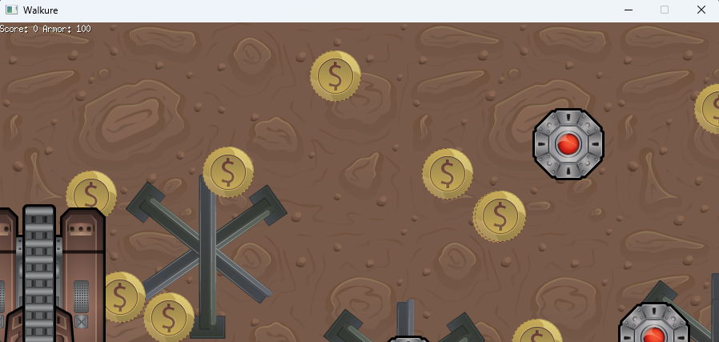
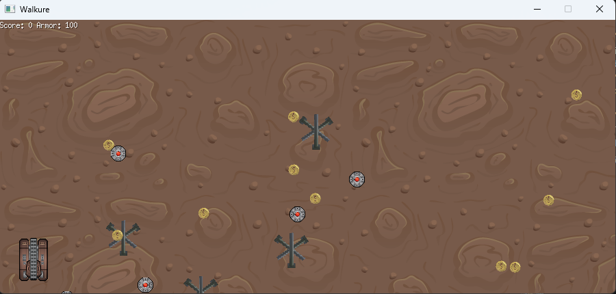

# Walkure

**Grok Code Fast 1 (Preview)** ile geliştirilen bir Windows platform oyunu. Oyunla ilgili bilgiler `GDG.md` dokümanında yer almaktadır.

```bash
#build etmek için src klasöründeyken
go build -o bin/walkure main.go
```

İlk çalışma zamanı çıktısı aşağıdaki gibidir.

Görüldüğü üzere ilk sürümde asset'lerin boyutları ile ilgili sorunlar oluştu. Bu problem oyun tasarım dokümanında assetlerin boyutlandırmaları ile ilgili kuralları iyi tanımlamadığımızdan kaynaklanıyor.



Soru cevap kısmında nispeten iyileşmeler söz konusu.



## Soru Geçmişi

**Soru 1 :** Hello. I'd like you to develop a game in Golang. You can find the necessary information in the game design documentation.

---

**Soru 2:** I have some errors.
.\main.go:119:39: mine.explosionImgs undefined (type *Mine has no field or method explosionImgs)

---

**Soru 3:** There are a few problems.
The assets in the game are used at their original size and appear very large. Can we scale them down proportionally and use them?

---

**Soru 4:** Tank and obstacle assets appear to be 4 times the size of mines. Can we make them smaller too?

---

**Soru 5:** I think the tank's direction of motion is wrong. Let's correct it by turning it 90 degrees clockwise.

---

**Soru 6:** We need to recalibrate in the exact opposite direction.

---

**Soru 7:** Mine explosion effects are too fast. Can you check your FPS values? 

---

**Soru 8:** When a tank passes over a gold coin, the coin remains on the stage. It should disappear.

---

**Soru 9:** When a mine explodes, the tank's Armor value does not decrease even if it is on or near the mine. Can you fix this?