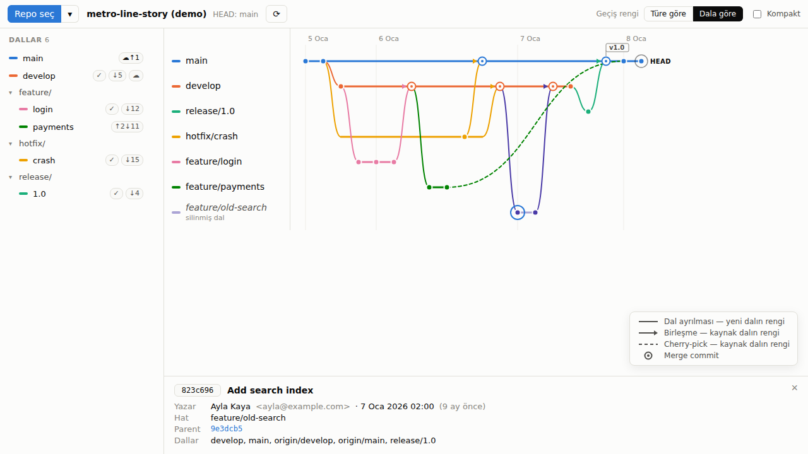
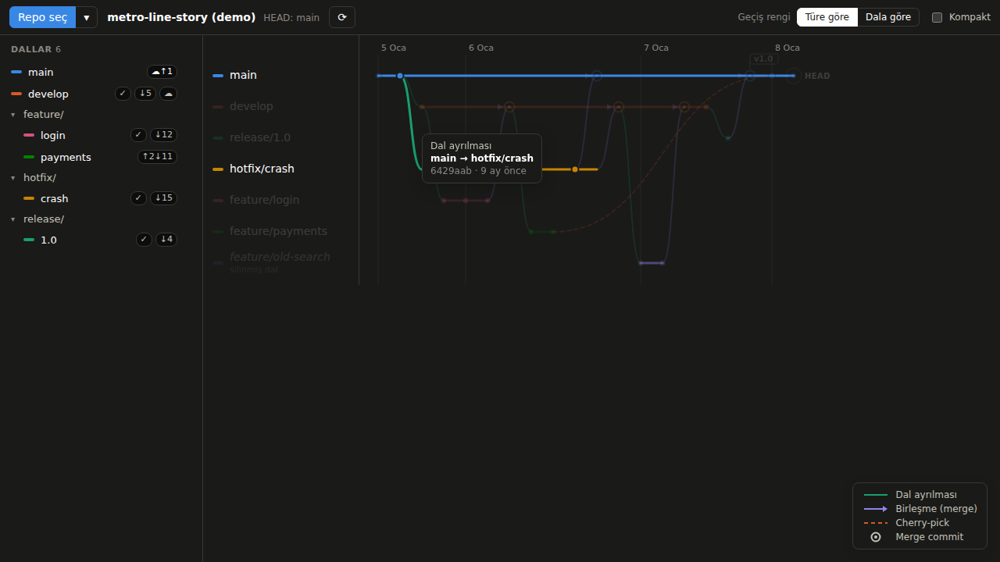
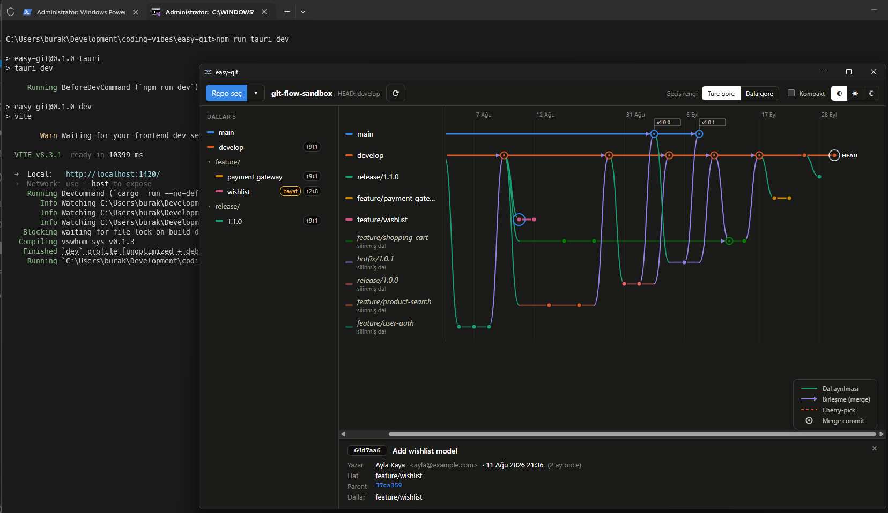
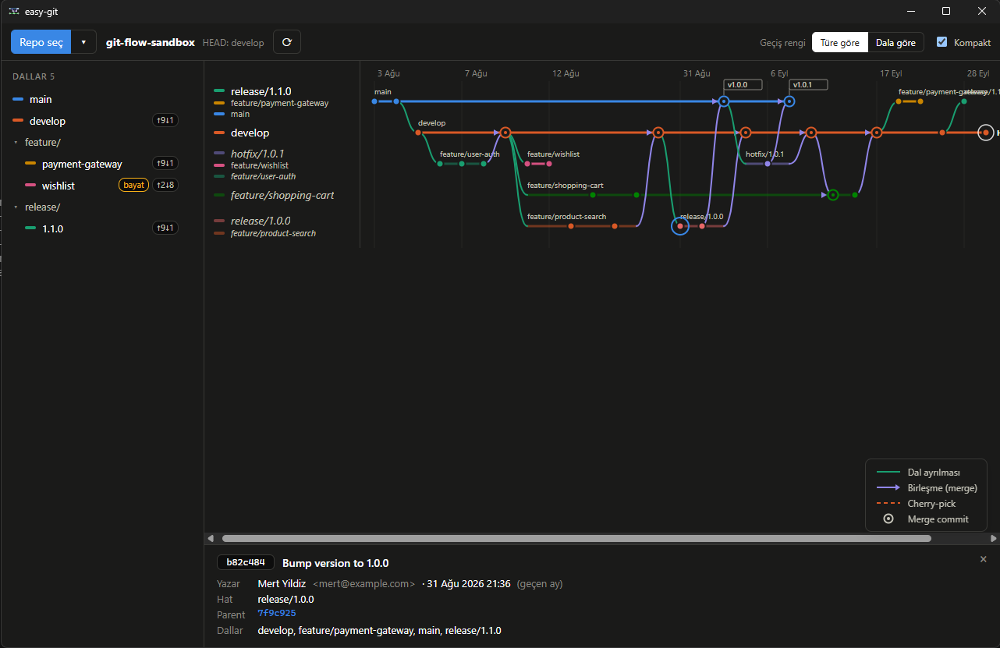
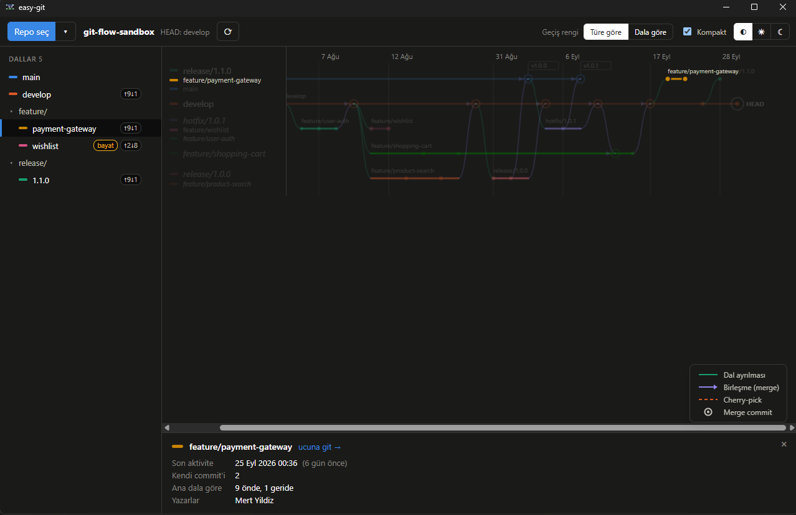
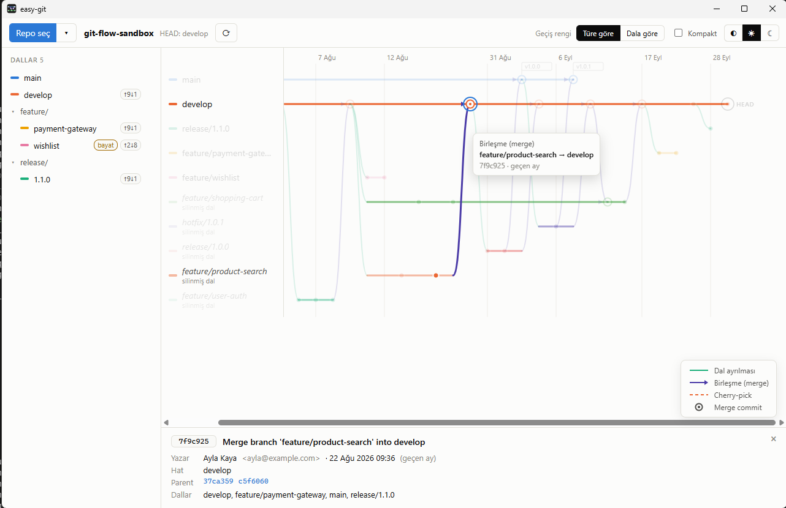
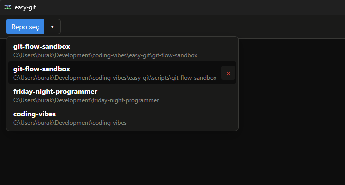
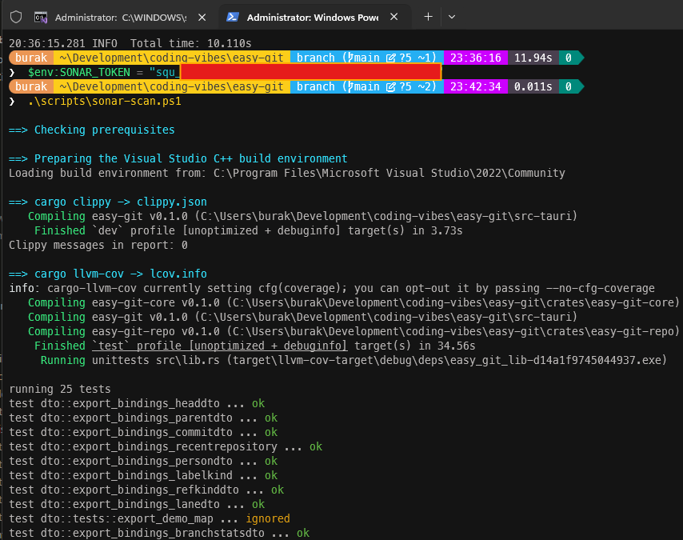
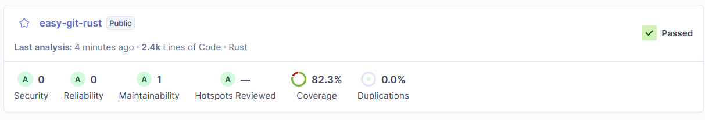
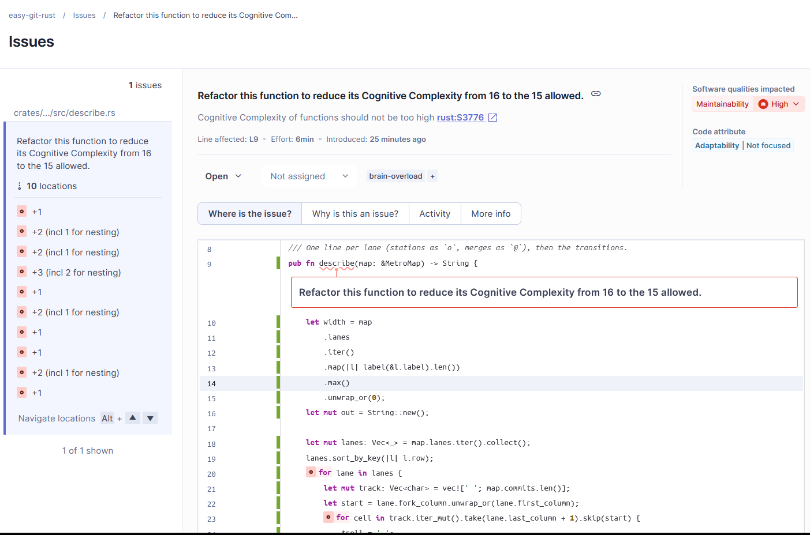

# easy-git

Git dallarını **metro haritası** gibi gösteren, salt okunur bir Windows masaüstü dashboard'u. Her dal soldan sağa akan bir hat, her commit bir istasyon; dalların ayrıldığı ve birleştiği yerler renkli makaslar.

**Rust + Tauri 2 + Svelte 5** · git erişimi **gitoxide (`gix`)** ile · repo'ya hiçbir şey yazmaz.



## Neler var (MVP — Faz 0–6)

- Yerel makineden repo seçme, son açılanlar listesi: kayıtlar × ile elle çıkarılabilir; taşınmış ya da silinmiş repolar bilgi verilerek kendiliğinden çıkarılır
- Dallar yatay hatlar halinde; açılışta en güncel commit'ler görünür
- Fork, merge ve cherry-pick geçişleri — **türe göre** ya da **dala göre** renklendirme, lejant
- Silinmiş ama merge edilmiş dalların adı merge mesajından geri bulunur
- Kenar çubuğu: ana dala göre ↑önde ↓geride, merge edildi ✓, bayat dal, remote durumu ☁
- Commit ve geçişlerde tooltip; tıklayınca detay paneli (parent'lar arasında gezinme)
- Dal gizleme/öne çıkarma, kompakt görünüm
- Gece/gündüz modu: Windows temasını izle (varsayılan), ya da araç çubuğundan ☀ / ☾ ile sabitle; seçim hatırlanır



## Çalıştırma

Gerekenler: Rust 1.90+ (MSVC), Visual Studio Build Tools (C++), Node.js 20+, WebView2.

```powershell
npm install
npm run tauri dev
```

Denemek için hazır bir örnek repo:

```powershell
cargo run -p easy-git-repo --example make-sample-repo -- C:\temp\easy-git-sample
# uygulamada: Repo seç → C:\temp\easy-git-sample\sample
```

Sadece arayüz üzerinde çalışmak için (Tauri'siz, demo verisiyle): `npm run dev` → http://localhost:1420

Testler:

```powershell
cargo test --workspace
npm run check
```

`describe` metninin performansını ölçmek için:

```powershell
cargo bench -p easy-git-core --bench describe
```

## Hızlı deneme: git flow örneği

Uzak bir repoya bağlanmadan, git flow modeline göre dallanmış hayali bir repo üretip easy-git'te açabilirsin. Windows'ta **Git Bash** içinden (Git for Windows ile gelir), Linux/macOS'ta herhangi bir terminalden:

```bash
./scripts/git-flow-demo.sh              # ./git-flow-sandbox klasörüne kurar
./scripts/git-flow-demo.sh ~/gf-deneme  # ya da istediğin klasöre
```

Betik son iki aya yayılan, bugün biten bir hikâye yazar; senin git ayarlarına ve kimliğine dokunmaz:

| Dal | Durum | easy-git'te beklenen |
|---|---|---|
| `main`, `develop` | yaşıyor | en üstteki iki hat; `v1.0.0` ve `v1.0.1` tag bayrakları `main`'de |
| `feature/user-auth`, `feature/product-search` | merge edildi, silindi | "silinmiş dal" hatları, adları merge mesajından |
| `feature/shopping-cart` | önce `develop`'u içine aldı, sonra merge edildi, silindi | `develop` → dal yönünde bir merge oku |
| `release/1.0.0`, `hotfix/1.0.1` | `main` ve `develop`'a merge edildi, silindi | aynı daldan iki hedefe iki merge |
| `feature/wishlist` | 7 hafta önce bırakıldı | kenar çubuğunda **bayat** rozeti |
| `feature/payment-gateway`, `release/1.1.0` | devam ediyor | açık uçlu hatlar |

Arayüzü açmadan metin çizimini görmek için:

```bash
cargo run -p easy-git-repo --example describe-repo -- ./git-flow-sandbox
```

## Dağıtım (başka bir Windows makinesi için)

Visual Studio 2022'nin **x64 Native Tools Command Prompt**'u içinden:

```powershell
npm install
npm run tauri build
```

Çıktılar proje kökündeki `target` altında:

| Dosya | Ne zaman |
|---|---|
| `target\release\bundle\nsis\easy-git_<sürüm>_x64-setup.exe` | **Önerilen.** Kullanıcı bazında kurar, yönetici izni istemez. |
| `target\release\bundle\msi\easy-git_<sürüm>_x64_en-US.msi` | Tüm makineye kurulum; yönetici izni ister. |
| `target\release\easy-git.exe` | Kurulumsuz, tek dosya. Ön yüz exe'ye gömülü. |

Hedef makinede Rust, Node, Visual Studio ya da **git gerekmez** (repo gix ile doğrudan okunur). WebView2 Windows 11'de hazır; eksikse kurulum dosyası indirip kurar. C çalışma zamanı `.cargo/config.toml` içindeki `+crt-static` ayarıyla exe'ye gömülü, `VCRUNTIME140.dll` aranmaz.

Bilinen durumlar:

- **"Windows bilgisayarınızı korudu" uyarısı:** kurulum dosyası imzasız. *Ek bilgi → Yine de çalıştır.* Kaldırmak için bir kod imzalama sertifikası `tauri.conf.json` → `bundle.windows` altına eklenir.
- **MSI adımı `light.exe` hatası verirse:** Windows'ta VBScript isteğe bağlı özelliği kapalı olabilir. Açabilir ya da `tauri.conf.json` → `bundle.targets` değerini `["nsis"]` yapabilirsin.
- **İlk `tauri build`** WiX ve NSIS araçlarını internetten indirir.
- **`LNK1104: cannot open file 'msvcrt.lib'`:** Rust, C++ bileşenleri eksik bir Visual Studio kurulumunu (ör. bir Insiders sürümü) seçmiş. Komutları VS 2022 Native Tools Command Prompt'tan çalıştır ya da o kuruluma *Desktop development with C++* workload'unu ekle.

Yeni sürüm çıkarırken `src-tauri\tauri.conf.json` içindeki `version` ile kökteki `Cargo.toml` → `[workspace.package] version` birlikte artırılmalı; kurulum dosyasının adı ve Windows'un yükseltme algılaması bu numaraya bağlı.

## Yapı

```
crates/easy-git-core   domain + şerit algoritması + dal istatistikleri (bağımlılıksız)
crates/easy-git-repo   gix adaptörü + test fixture'ı
src-tauri              Tauri command'ları, state, DTO'lar (ts-rs ile TS tipleri)
src                    Svelte 5 ön yüz
docs                   plan ve tutorial serisi
```

## Tutorial serisi

| Faz | Konu |
|---|---|
| [00](docs/tutorial/00-kurulum-ve-iskelet.md) | Kurulum, Cargo workspace, Tauri + Svelte iskeleti |
| [01](docs/tutorial/01-gix-ile-git-okuma.md) | gix ile ref, HEAD ve geçmiş okuma; deterministik fixture |
| [02](docs/tutorial/02-serit-algoritmasi.md) | Şerit algoritması: commit'i dala atamak, geçişler, snapshot testleri |
| [03](docs/tutorial/03-tauri-kopru.md) | Tauri command'ları, state, DTO + ts-rs, capability'ler |
| [04](docs/tutorial/04-svg-ile-cizim.md) | SVG ile hatlar ve istasyonlar |
| [05](docs/tutorial/05-gecisler-ve-renkler.md) | Geçiş eğrileri, iki renk modu, satır sıkıştırma |
| [06](docs/tutorial/06-etkilesim-ve-paneller.md) | Tooltip, detay paneli, ahead/behind, bayat dal |

Plan ve sonraki fazlar: [docs/PLAN.md](docs/PLAN.md)

## Örnek Çalışma Zamanı Çıktısı



Kompakt görünüm;



Belli bir dal seçimi;



Gece/Gündüz modu eklendikten sonra;



Listeden repo kaldırma



## Kod Kalite Metrikleri

**Claude Opus 5.5**'in yazdığı **Rust** kodlarını **SonarQube** ile analiz etmek için yerel makinemde `docker-compose` ile çalıştırdığım **SonarQube Community Build** (26.8) sürümünü kullandım. Rust analyzer bu sürümde yerleşik geliyor, ek bir eklenti kurmak gerekmiyor. Analiz iki parçadan oluşuyor:

- **Host tarafı:** Clippy raporu (`clippy.json`) ve test kapsamı raporu (`lcov.info`) proje makinesinde `cargo` ile üretiliyor.
- **Container tarafı:** `sonarsource/sonar-scanner-cli` imajı, SonarQube'un bağlı olduğu compose ağına katılıyor, kodu ve raporları okuyup sunucuya gönderiyor. İmajda `cargo` yok, bu yüzden raporların önceden hazır olması gerekiyor.

Bu adımların hepsini `scripts` klasöründeki iki betik yapıyor.

### Bir kerelik hazırlık

1. SonarQube arayüzünde **Create Project → Local project** ile `easy-git-rust` anahtarlı bir proje oluşturdum. Rust, dil seçenekleri arasında listelenmiyor; **Other** seçeneğiyle ilerlemek yeterli.
2. *My Account → Security* altında bir token ürettim. **User Token** (`squ_`) ya da **Global Analysis Token** (`sqa_`) en az sorun çıkaranlar. **Project Analysis Token** (`sqp_`) kullanılacaksa mutlaka `easy-git-rust` projesi için üretilmiş olmalı.
3. Coverage için `cargo-llvm-cov` aracını kurdum:

   ```powershell
   rustup component add llvm-tools-preview
   cargo install cargo-llvm-cov
   ```

   Windows'ta düz PowerShell'de derleme/link hatası alırsan bu komutları **Developer Command Prompt for VS 2022** içinden çalıştır.

Proje kökündeki `sonar-project.properties` dosyası analiz ayarlarını tutuyor:

```properties
sonar.projectKey=easy-git-rust
sonar.projectName=easy-git-rust
sonar.sourceEncoding=UTF-8

# Kökteki src/ Svelte ön yüzü olduğu için dışarıda; yalnızca Rust crate'leri taranıyor
sonar.sources=crates/easy-git-core/src,crates/easy-git-repo/src,crates/easy-git-repo/examples,src-tauri/src,src-tauri/build.rs
sonar.tests=crates/easy-git-repo/tests

# Clippy'yi scanner çalıştırmıyor (imajda cargo yok), host'ta üretilen rapor içe aktarılıyor
sonar.rust.clippy.enabled=false
sonar.rust.clippy.reportPaths=clippy.json

# cargo-llvm-cov ile üretilen coverage raporu (yollar /usr/src'ye çevrilmiş halde)
sonar.rust.lcov.reportPaths=lcov.info
```

### Taramayı çalıştırma

Windows (düz PowerShell ya da Developer Command Prompt fark etmez):

```powershell
$env:SONAR_TOKEN = "squ_..."
.\scripts\sonar-scan.ps1
# Execution policy engel olursa:
# powershell -ExecutionPolicy Bypass -File scripts\sonar-scan.ps1
```

Linux / macOS:

```bash
SONAR_TOKEN=squ_... ./scripts/sonar-scan.sh
```

Her iki betik de `-SkipClippy` / `-SkipCoverage` (Linux'ta `--skip-clippy` / `--skip-coverage`) seçeneklerini destekliyor. Sunucu adresi ve compose ağı varsayılan olarak `http://sonarqube:9000` ve `northwind-platform_northwind-net`; farklıysa `SONAR_HOST_URL` ve `SONAR_DOCKER_NETWORK` ortam değişkenleriyle değiştirilebilir. Sonuçlar: http://localhost:9000/dashboard?id=easy-git-rust

Betiklerin yaptıkları sırasıyla:

1. **(Yalnızca Windows)** Visual Studio 2022'nin x64 C++ ortamını `vswhere` ile bulup oturuma yüklüyor. Böylece Developer Command Prompt açmaya gerek kalmıyor; zaten oradan çalıştırılıyorsa bu adım atlanıyor.
2. `cargo clippy --workspace --all-targets --message-format=json` çıktısını `clippy.json` dosyasına yazıyor. Windows'ta yönlendirme `cmd` üzerinden yapılıyor, çünkü Windows PowerShell'in `>` operatörü dosyayı UTF-16 yazıyor ve scanner bu dosyayı okuyamıyor.
3. `cargo llvm-cov --workspace --lcov --output-path lcov.info` ile testleri çalıştırıp coverage raporunu üretiyor.
4. `lcov.info` içindeki mutlak yolları (`SF:C:\Users\...\easy-git\...`) container'daki karşılığına (`SF:/usr/src/...`) çeviriyor. Bu yapılmazsa SonarQube raporu dosyalarla eşleştiremiyor ve coverage %0 görünüyor.
5. Scanner container'ını compose ağına bağlayıp proje klasörünü `/usr/src` olarak içine bağlıyor. Token komut satırında görünmesin diye ortam değişkeni adıyla aktarılıyor.

### Karşılaştığım sorunlar

| Belirti | Sebep | Çözüm |
|---|---|---|
| `You're not authorized to analyze this project or the project doesn't exist` (403) | `sonar.projectKey` sunucudaki proje anahtarıyla eşleşmiyordu (`easy-git` ↔ `easy-git-rust`) | Anahtarı arayüzdeki proje anahtarıyla aynı yapmak |
| `HTTP 401 Unauthorized` | Token hatalı kopyalanmış (ön eki dahil) | Token'ı bir ortam değişkenine bir kez atayıp oradan kullanmak |
| `Cannot run program "cargo"` | Clippy sensörü varsayılan olarak `cargo clippy`'yi kendisi çalıştırmaya çalışıyor | `sonar.rust.clippy.enabled=false` |
| Coverage %0 | `lcov.info` içindeki Windows yolları container'daki yollarla eşleşmiyor | Betikteki yol dönüşümü (4. adım) |
| `SCM provider autodetection failed` uyarısı | Container içinden git bilgisi okunamıyor | Analizi etkilemiyor; yalnızca satır bazlı blame bilgisi eksik kalıyor |

`clippy.json`, `lcov.info` ve `.scannerwork/` üretilen dosyalar olduğu için `.gitignore`'a eklendi.

### SonarQube Tarama Sonuçları

Shell script'i çalıştırdığımızda aşağıdakine benzer bir çıktı oluşmalı.



Kod üzerinde review istemediğimi düşünürsek ilk bulgular oldukça temiz görünüyor.



Şimdilik tek bulgu cognitive complexity değeri sınırı aşmış bir fonksiyon.


